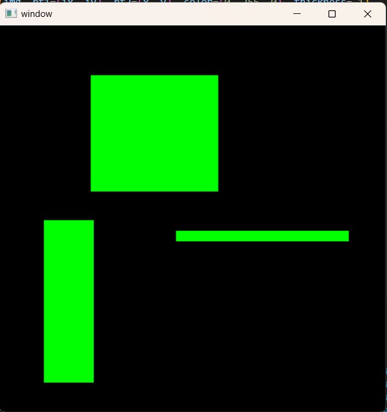
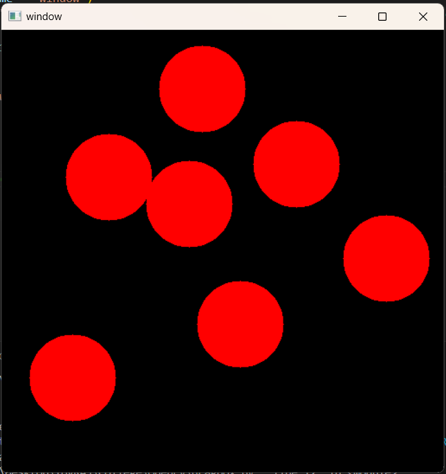

# 📷 Image Processing With OpenCV

A companion repo for the Image Processing using OpenCV

## 📚 Topics Covered
- Image Reading & Display  
- Image Writing  
- Color Spaces (BGR, Grayscale, HSV)  
- Resizing & Cropping  
- Drawing Shapes & Text  
- Geometric Transforms (Translate, Rotate, Scale)  
- Thresholding  
- Edge Detection  
- Blurring & Smoothing  
- Contour Detection  
- Masking & Bitwise Ops  
- Real‑Time Webcam Processing  

## 📸 Example Outputs

### Image Reading Example:

<!-- Replace with your image path -->

### Edge Detection Example:

### Drawing Shapes Example:

## 🚀 Getting Started
1. Clone this repo  
2. Install dependencies: pip install opencv-python  
3. Follow along each topic with the corresponding video
